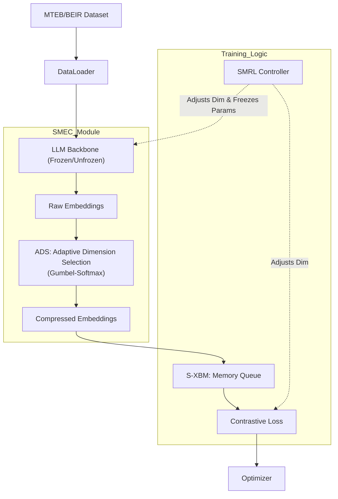

# Kế hoạch Thực hiện: SMEC (Sequential Matryoshka Embedding Compression)

> **Lưu ý**: Kế hoạch này được xây dựng dựa trên tài liệu `report.md` và paper gốc "SMEC: Rethinking Matryoshka Representation Learning for Retrieval Embedding Compression".

## Mục tiêu Dự án
Triển khai thuật toán SMEC để nén vector nhúng từ các mô hình ngôn ngữ lớn (LLMs) nhằm tối ưu hóa chi phí lưu trữ và tìm kiếm mà không làm giảm đáng kể độ chính xác.

## User Review Required (Cần User Phê duyệt)

> [!IMPORTANT]
> **Giả định Kỹ thuật**:
> - Ngôn ngữ: **Python 3.10+**
> - Framework: **PyTorch**, **HuggingFace Transformers**, **Sentence Transformers**.
> - Hardware: Yêu cầu GPU (NVIDIA CUDA) để huấn luyện mô hình (khuyến nghị VRAM >= 24GB nếu dùng Qwen2-7B, hoặc nhỏ hơn nếu dùng model nhỏ hơn).
> - Base Model: Sẽ bắt đầu thử nghiệm với model nhỏ (ví dụ: `BERT-base` hoặc `LLM2Vec-Sheared-LLaMA`) trước khi scale lên `Qwen2-7B` như trong báo cáo.

> [!NOTE]
> **Dữ liệu**:
> Sẽ sử dụng tập dữ liệu benchmark chuẩn **MTEB/BEIR** (ví dụ: dataset Quora, NFCorpus) để đánh giá, vì SMEC tập trung vào Information Retrieval.

---

## 1. Requirements Analysis (Phân tích Yêu cầu)

### Functional Requirements (EARS)
1. **WHEN** hệ thống khởi động **THE SYSTEM SHALL** tải cấu hình (model name, dimensions, hyperparameters).
2. **WHEN** khởi tạo mô hình **THE SYSTEM SHALL** tích hợp module `ADS` (Adaptive Dimension Selection) vào lớp output của model.
3. **WHEN** huấn luyện (training) **THE SYSTEM SHALL** thực hiện chiến lược `SMRL` (Sequential Matryoshka), tối ưu lần lượt các kích thước vector giảm dần (ví dụ: Full -> D/2 -> D/4).
4. **WHEN** chuyển sang kích thước nhỏ hơn **THE SYSTEM SHALL** đóng băng (freeze) các tham số đã tối ưu ở bước trước đó (theo cơ chế SMRL).
5. **WHEN** tính toán loss **THE SYSTEM SHALL** sử dụng `S-XBM` (Selective Cross-Batch Memory) để lấy mẫu hard negatives từ hàng đợi bộ nhớ.
6. **WHEN** lựa chọn chiều (dimension selection) **THE SYSTEM SHALL** dùng Gumbel-Softmax để học mask chọn chiều quan trọng (ADS).
7. **WHEN** đánh giá (evaluation) **THE SYSTEM SHALL** tính toán chỉ số NDCG@10 trên tập test BEIR.

### Non-Functional Requirements
- **Simplicity**: Code module hóa rõ ràng (Model, Loss, Trainer).
- **Extensibility**: Dễ dàng thay thế backbone model (VD: từ BERT sang LLaMA).

---

## 2. Design Specification (Thiết kế)

### Kiến trúc Hệ thống

### Các Module Chính
1.  **`SMECModel`**: Wrapper class chứa Backbone model và ADS layer.
2.  **`ADSLayer`**: Layer thực hiện học chọn chiều (Learnable mask).
3.  **`MemoryQueue`**: Class quản lý hàng đợi FIFO cho S-XBM, hỗ trợ truy vấn top-k hard negatives.
4.  **`SMECTrainer`**: Custom trainer loop xử lý quy trình huấn luyện tuần tự (Sequential training).

---

## 3. Proposed Changes (Kế hoạch Triển khai)

### Phase 1: Environment & Data Setup
Thiết lập môi trường và pipeline dữ liệu.
#### [NEW] [requirements.txt]
- `torch`, `transformers`, `datasets`, `sentence-transformers`, `wandb` (logging).
#### [NEW] [src/data/loader.py]
- Hàm load dataset từ MTEB/BEIR, format dữ liệu cho Contrastive Learning (Query, Positive, Negative).

### Phase 2: Core Implementation (SMEC Architecture)
Xây dựng các thành phần cốt lõi của SMEC.
#### [NEW] [src/models/ads.py]
- Implement lớp `AdaptiveDimensionSelection` dùng Gumbel-Softmax.
#### [NEW] [src/models/memory.py]
- Implement `SelectiveCrossBatchMemory` (queue, enqueue, retrieve top-k).
#### [NEW] [src/models/smec_wrapper.py]
- Wrapper kết hợp Backbone + ADS.

### Phase 3: Training Logic (SMRL)
Implement vòng lặp huấn luyện tuần tự.
#### [NEW] [src/trainer.py]
- Custom loop: Train Dim 1 -> Freeze -> Train Dim 2 -> Freeze...
- Tích hợp S-XBM vào loss calculation.

### Phase 4: Evaluation & Main Entry
#### [NEW] [src/evaluate.py]
- Script chạy đánh giá trên bộ test MTEB.
#### [NEW] [main.py]
- Entry point để chạy training/eval từ dòng lệnh.

---

## 4. Verification Plan (Kế hoạch Kiểm thử)

### Automated Tests
Sẽ tạo các unit test để kiểm tra tính chính xác của thuật toán:
1.  **Test ADS**: Kiểm tra output shape có giảm đúng kích thước không và gradient có truyền qua Gumbel-Softmax không.
    - `python -m pytest tests/test_ads.py`
2.  **Test S-XBM**: Kiểm tra queue có cập nhật FIFO và trả về đúng hard negatives không.
    - `python -m pytest tests/test_memory.py`
3.  **Test SMRL Locking**: Kiểm tra xem tham số của chiều cũ có thực sự bị đóng băng (gradient=0) khi train chiều mới không.
    - `python -m pytest tests/test_freezing.py`

### Manual Verification
- Chạy thử nghiệm trên tập dữ liệu nhỏ (ví dụ: `sts-benchmark` hoặc `quora` subset) với 1 epoch cho mỗi step nén để đảm bảo pipeline chạy không lỗi (End-to-End Test).
- Kiểm tra logs (WandB/Tensorboard) để xem Loss có giảm kịch tính ở đầu mỗi giai đoạn chuyển tiếp kích thước không.
