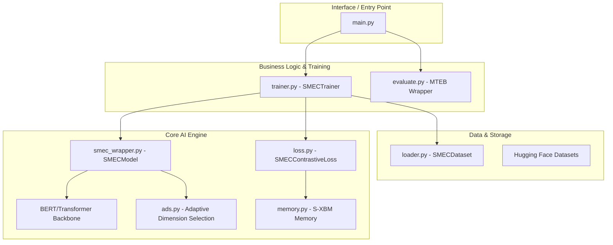
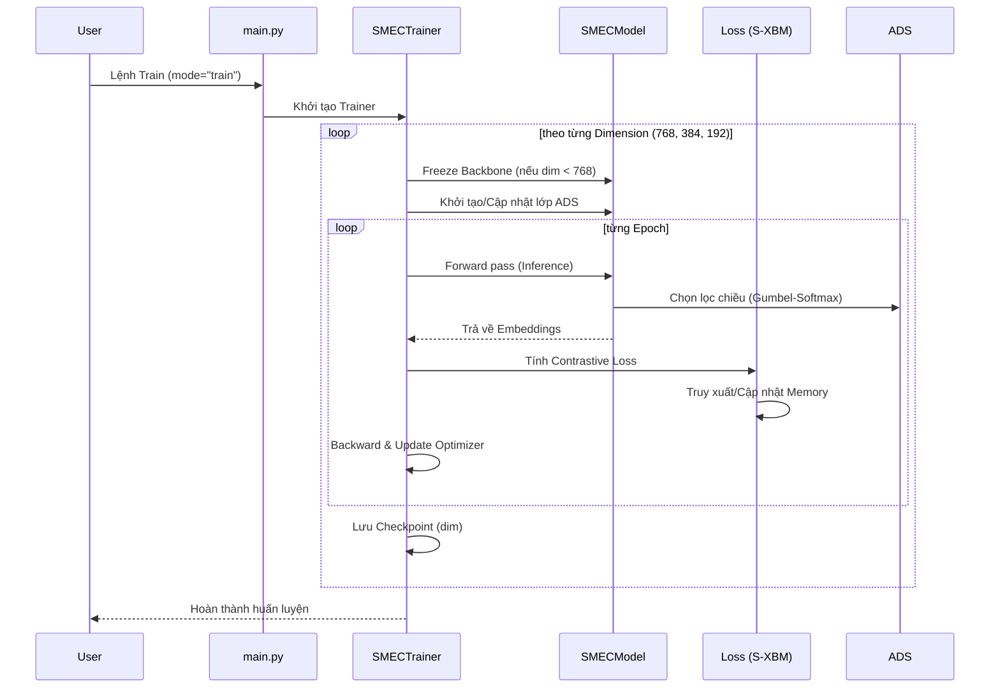
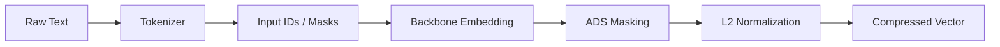

# Tài liệu Kiến trúc Hệ thống SMEC

---

## 1. Tổng quan Dự án (Project Overview)

- **Tên dự án**: SMEC (Sequential Matryoshka Embedding Compression)
- **Mục đích**: Triển khai phương pháp nén vector nhúng (embeddings) cho các hệ thống Retrieval (tìm kiếm thông tin) dựa trên nghiên cứu về Matryoshka Representation Learning.
- **Technology Stack**: Python, PyTorch, Transformers (Hugging Face), MTEB Benchmark.
- **Vấn đề cốt lõi**: Các vector nhúng từ LLMs thường có số chiều lớn (ví dụ: 768), gây tốn kém lưu trữ và chậm khi tìm kiếm. Việc cắt tỉa thủ công làm giảm mạnh độ chính xác.
- **Giải pháp SMEC**: Kết hợp huấn luyện tuần tự (SMRL) và chọn lọc chiều động (ADS) để tạo ra các vector nhúng "lồng nhau", cho phép nén tới 12-14 lần mà vẫn giữ được >99% hiệu năng.

---

## 2. Kiến trúc Tổng thể (Overall Architecture)

### Thành phần chính:
- **UI Layer**: `main.py` nhận tham số dòng lệnh để điều phối chế độ Train hoặc Eval.
- **Model Layer**: Trái tim của hệ thống, nơi `SMECModel` bao bọc một Transformer Backbone và tích hợp lớp `ADS` để học cách nén.
- **Data Layer**: `SMECDataset` hỗ trợ nạp dữ liệu từ Hugging Face (Quora, STS, v.v...) và xử lý tokenization.

---

## 3. Quy trình làm việc (Overall Workflow)

---

## 4. Đường dẫn xử lý dữ liệu (Data Processing Pipeline)

- **Input**: Văn bản thô từ dataset (ví dụ: Quora pairs).
- **ADS Masking**: Điểm đặc biệt của SMEC, sử dụng trọng số sigmoid để "tắt/mở" các chiều thay vì cắt bỏ cứng nhắc.
- **Output**: Vector có số chiều thấp nhưng chứa thông tin quan trọng nhất của toàn bộ vector gốc.

---

## 5. Phân tích Module Chi tiết (Module Analysis)

### Module: `src/models/ads.py`
- **Mục đích**: Thực hiện cơ chế chọn lọc chiều thích ứng.
- **Logic chính**: Sử dụng một tham số `gate_logits`. Trong quá trình huấn luyện, dùng Gumbel-Softmax (hoặc Sigmoid) để tạo mask.
- **Forward**: `x * sigmoid(gate_logits)`.

### Module: `src/models/memory.py` (S-XBM)
- **Mục đích**: Lưu trữ các vector nhúng từ các batch trước đó để làm "hard negatives".
- **Cơ chế**: FIFO Queue với bộ nhớ cố định. Sử dụng phép nhân ma trận để tìm các mẫu tương đồng nhất làm đối trọng cho loss.

---

## 6. Phân tích File Quan trọng (File Analysis)

### `src/trainer.py`
- **Chức năng**: Quản lý vòng lặp huấn luyện SMRL (Sequential Matryoshka Representation Learning).
- **Đặc điểm**:
    - Tự động đóng băng (freeze) backbone sau khi huấn luyện xong Dimension lớn nhất (768).
    - Tự động đẩy mô hình lên thiết bị (CUDA/CPU).
    - Quản lý `GradScaler` cho huấn luyện số thực hỗn hợp (FP16).

---

## 7. Các Design Patterns áp dụng
- **Wrapper Pattern**: `SMECModel` bao quanh các thư viện `transformers` để mở rộng chức năng mà không thay đổi mã nguồn gốc của thư viện.
- **Strategy Pattern (Sequential)**: Trainer thay đổi chiến lược huấn luyện (tập trung vào ADS) tùy theo giai đoạn của dimension hiện tại.
- **Singleton (Logger)**: Sử dụng logging thống nhất trong toàn bộ project.

---

## 8. Vấn đề và Giải pháp (Problems & Solutions)

| Vấn đề | Giải pháp SMEC |
|:--- |:--- |
| Trôi gradient khi nén sâu | **SMRL**: Huấn luyện từ chiều lớn xuống nhỏ, dùng trọng số chiều lớn làm mốc. |
| Mất mát thông tin khi cắt tĩnh | **ADS**: Học cách phân bổ trọng số cho từng chiều. |
| Thiếu Hard Negatives trong batch nhỏ | **S-XBM**: Tận dụng bộ nhớ hàng đợi để lấy thêm mẫu khó. |

---

## 9. Hiệu năng và Tối ưu hóa (Performance)
- **Mixed Precision (FP16)**: Giảm 50% dung lượng VRAM và tăng tốc huấn luyện 2-3 lần trên card đồ họa RTX (như chiếc 4070 bạn đang dùng).
- **L2 Normalization**: Đảm bảo embedding luôn nằm trên mặt cầu đơn vị, giúp contrastive loss ổn định hơn.

---

## 10. Chiến lược Kiểm thử (Testing)
- **MTEB Benchmark**: Sử dụng bộ tiêu chuẩn vàng để đo đạc.
- **STSBenchmark**: Được chọn làm bài test nhanh (Sanity Check) sau mỗi lần train.
- **Sequential Validation**: Sau mỗi dimension, một checkpoint được lưu lại để đảm bảo quá trình huấn luyện chuyển đổi mượt mà.

---
**Summary**: SMEC là một kiến trúc tiên tiến giúp tối ưu hóa chiều sâu đặc trưng. Hệ thống được thiết kế theo dạng module hóa cao, dễ dàng thay đổi backbone model và dataset kiểm thử.

