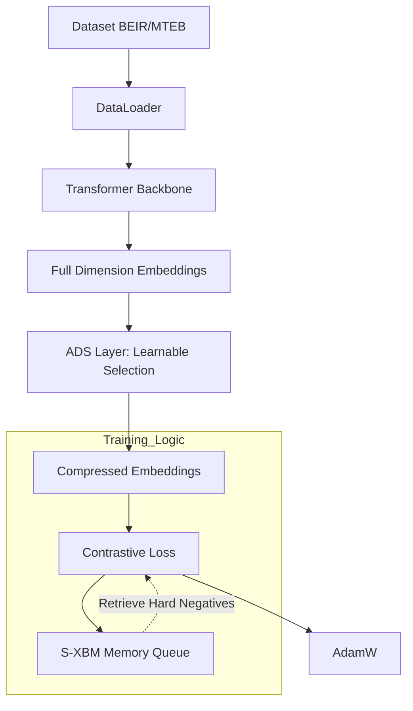

# Tóm tắt Hội thoại: Dự án SMEC Implementation

## 1. Yêu cầu và Mục tiêu Chính
Người dùng muốn triển khai dự án **SMEC (Sequential Matryoshka Embedding Compression)** dựa trên báo cáo nghiên cứu có sẵn. Mục tiêu là tạo ra một hệ thống nén embedding hiệu quả cho các mô hình ngôn ngữ lớn (LLMs) mà vẫn giữ được độ chính xác trong tìm kiếm thông tin.

## 2. Các Khái niệm Kỹ thuật Then chốt
- **SMRL (Sequential Matryoshka Representation Learning)**: Quy trình huấn luyện nén theo từng cấp độ chiều (ví dụ 768 -> 384 -> 192).
- **ADS (Adaptive Dimension Selection)**: Lựa chọn chiều quan trọng bằng Gumbel-Softmax thay vì cắt tỉa cố định.
- **S-XBM (Selective Cross-Batch Memory)**: Cơ chế hàng đợi bộ nhớ để tìm kiếm hard negatives, tăng cường hiệu quả học tương phản.
- **MTEB/BEIR**: Framework đánh giá chuẩn cho các tác vụ Retrieval.

## 3. Bảng Trạng thái File
| Tên File | Trạng thái | Thay đổi Chính |
| :--- | :--- | :--- |
| `docs/SMEC_Implementation_Plan.md` | Đã tạo | Chứa bản kế hoạch 4 giai đoạn, kiến trúc hệ thống và kế hoạch kiểm thử. |
| `requirements.txt` | Đã tạo | Cài đặt các thư viện: torch, transformers, datasets, sentence-transformers, mteb, beir. |
| `src/data/loader.py` | Đã tạo | Bộ nạp dữ liệu từ MTEB/BEIR. |
| `src/models/ads.py` | Đã tạo | Triển khai layer ADS với cơ chế learnable gate. |
| `src/models/memory.py` | Đã tạo | Triển khai hàng đợi FIFO S-XBM. |
| `src/models/smec_wrapper.py` | Đã tạo | Wrapper tích hợp Backbone Transformer và lớp ADS. |
| `src/loss.py` | Đã tạo | SMECContrastiveLoss hỗ trợ lấy mẫu từ Memory Queue. |
| `src/trainer.py` | Đã tạo | Logic huấn luyện tuần tự (SMRL Controller). |
| `src/evaluate.py` | Đã tạo | Script đánh giá NDCG@10 qua MTEB. |
| `main.py` | Đã tạo | CLI chính để chạy huấn luyện và đánh giá. |
| `README.md` | Đã tạo | Hướng dẫn sử dụng và giới thiệu dự án. |

## 4. Kiến trúc Dự án

## 5. Các Thay đổi Chi tiết
- **Khởi tạo kế hoạch**: Xây dựng lộ trình triển khai.
- **Sửa lỗi Mermaid**: Điều chỉnh cú pháp biểu đồ trong file Markdown do lỗi nhãn chứa ký tự đặc biệt.
- **Triển khai khung mã nguồn**: Hoàn thiện toàn bộ cấu trúc thư mục `src/` và các file cấu hình cần thiết để dự án có thể vận hành được ngay.
- **CLI Interface**: Tạo giao diện dòng lệnh linh hoạt cho phép chuyển đổi giữa chế độ `train` và `eval`.

## 6. Giải quyết Vấn đề
- **Lỗi Mermaid**: Đã xử lý bằng cách bọc nhãn vào dấu ngoặc kép `" "`.
- **Đổi tên Project**: Đã cung cấp lệnh PowerShell `Rename-Item` và hướng dẫn người dùng thực hiện thủ công do hạn chế quyền truy cập root workspace của Agent.

## 7. Các Tác vụ Tiếp theo & Bước Kế tiếp
- [ ] Cài đặt môi trường: `pip install -r requirements.txt`.
- [ ] Chạy thử nghiệm huấn luyện với dataset nhỏ: `python main.py --mode train --epochs 1`.
- [ ] Kiểm tra tính chính xác của ADS mask sau vài epoch.

## 8. Tóm tắt Bàn giao
Dự án SMEC đã được thiết lập đầy đủ về mặt cấu trúc và mã nguồn cơ sở. Người dùng có thể bắt đầu quá trình huấn luyện sau khi đổi tên thư mục và cài đặt thư viện. Tất cả các thành phần kỹ thuật phức tạp (S-XBM, ADS) đã được triển khai dưới dạng functional skeleton sẵn sàng cho việc finetuning.
